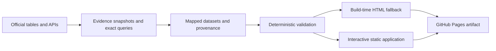

# where-is-the-tax — Project Plan

One page that answers two questions for Germany in a selected year:

1. Where does public revenue come from?
2. What does general government spend money on?

The first release is an English-language, desktop-first explanation for interested non-experts.
It uses official statistics, exposes the accounting limits, and lets every displayed number be
traced to an exact source observation.

---

## 1. Product contract

### Primary user and outcome

The primary user is an English-speaking person who wants to understand German public finances
but is not expected to know German administrative terminology or national-accounting jargon.

Within a few minutes, that person should be able to:

- identify total general-government revenue and expenditure for the selected year;
- see the largest revenue and expenditure categories;
- understand that the two sides describe one public-finance system but do not trace individual
  taxes to individual services;
- interpret the difference between revenue and expenditure as net lending or net borrowing,
  not as a direct measure of the change in government debt;
- drill into the deepest compatible official detail available; and
- inspect the source, status, transformation, and caveats behind any number.

### Principles

1. **One accounting frame per hierarchy.** Additive parents and children must use the same
   reference period, sector, accounting basis, unit, and compatible source vintage.
2. **Every number is reproducible.** A generic webpage URL is not enough. Each value records
   the exact table or API coordinates, release and retrieval dates, raw observation,
   transformation, evidence snapshot or checksum, and review status.
3. **Plain English leads.** English display names and explanations come first. The official
   German name appears as secondary terminology when useful.
4. **Uncertainty stays visible.** Provisional, estimated, and forecast observations remain
   labelled. The project may publish a provisional coherent dataset; it never silently upgrades
   one to final.
5. **No fabricated causality.** The site does not imply that a particular tax pays for a
   particular function. Public revenue is largely fungible.
6. **Depth is earned by compatibility.** Include as much official detail as is statistically
   defensible. Stop when deeper data would require mixing accounting frameworks or vintages.
7. **Static and inspectable.** The product has no backend, account system, tracking, or runtime
   dependency on an AI service. Data and research artifacts live in the repository.

### Explicit v1 non-goals

- German-language UI or bilingual content. English is the only interface and editorial language.
- Internationalization infrastructure or translation sidecars.
- A personalized tax receipt based on salary or household inputs.
- Direct tax-to-spending flow claims.
- Cross-country comparison in the public product.
- Year-over-year comparison before at least two reconciled years exist.
- Real-time or automatically changing official data.
- A commitment to a Sankey, treemap, or any other chart type before comprehension testing.

---

## 2. Accounting contract

### Scope

The product uses **consolidated general government under ESA 2010, sector S.13**:

- central government;
- state government;
- local government; and
- social-security funds.

Transfers inside general government are consolidated. The site must not build a national total
by adding gross federal, state, municipal, and social-insurance accounts.

Expenditure is classified by function using COFOG. This answers what government resources are
used for—social protection, health, education, defence, and so on—rather than which ministry
administers them.

### Publication policy

For each release, choose the newest reference year for which revenue and expenditure can form a
complete, internally coherent ESA dataset. A coherent provisional year is preferable to an older
year described incorrectly as current or final.

The research run must determine and record:

- the selected reference year and why it is the newest usable year;
- the release/vintage of each official dataset used;
- whether the resulting bundle is final, provisional, estimated, forecast, or mixed;
- whether later revisions are expected; and
- the previous final year, when showing it would materially help the reader understand the
  provisional status.

Germany 2024 is the initial candidate, not a fact hard-coded into the application plan. The data
collection run must confirm the latest available observations and their status before creating
the first dataset.

### Revenue definition

Top-level revenue uses ESA transactions from the same compatible `gov_10a_main` observation set:

| Stable id | Display name | ESA anchor |
|---|---|---|
| `production_import_taxes` | Taxes on products and production | D.2 |
| `income_wealth_taxes` | Taxes on income and wealth | D.5 |
| `social_contributions` | Net social contributions | D.61 |
| `capital_taxes` | Capital taxes | D.91 |
| `other_revenue` | Other general-government revenue | Total revenue less the four categories above, or an equivalent exhaustive set of reported ESA components from the same vintage |

`other_revenue` must be marked `derived` when calculated. Its provenance must list the total and
all inputs, formula, sign convention, and rounding rule.

Deeper tax detail should come from Eurostat `gov_10a_taxag` and the National Tax Lists when those
observations are ESA-compatible with the parent totals. National cash-tax publications may add
context, but their values must not be inserted as additive children beneath ESA accrual parents.

### Expenditure definition

Top-level expenditure is the complete set of ten COFOG divisions from `gov_10a_exp`:

| Stable id | COFOG | Display name |
|---|---|---|
| `general_public_services` | GF01 | General public services |
| `defence` | GF02 | Defence |
| `public_order_safety` | GF03 | Public order and safety |
| `economic_affairs` | GF04 | Economic affairs |
| `environment_protection` | GF05 | Environmental protection |
| `housing_community` | GF06 | Housing and community amenities |
| `health` | GF07 | Health |
| `recreation_culture_religion` | GF08 | Recreation, culture and religion |
| `education` | GF09 | Education |
| `social_protection` | GF10 | Social protection |

Use second-level COFOG groups where Germany reports them for the selected year and vintage. Do
not substitute ESSPROS, ministry budgets, or national cash tables for missing COFOG children.
Those sources may support clearly separated explanatory context.

### Balance definition

The summary shows:

`net lending / net borrowing = total revenue - total expenditure`

A positive result is net lending/surplus; a negative result is net borrowing/deficit. It is not
labelled “new debt” or “new borrowing”, because the change in gross government debt also depends
on financial transactions, valuation changes, and other stock-flow adjustments.

### Additivity and contextual data

Every available value has an origin:

- **reported** — copied from an official observation;
- **derived** — calculated from compatible reported observations.

Separately, its classification is either **direct**—the official category already matches the
project concept—or **mapped**—an official category is assigned to the project's stable vocabulary
without changing its amount. Origin and mapping are separate because a mapped value is still a
reported observation, not a third kind of number.

Only compatible values may participate in parent-child addition. Cash-basis figures, ministry
budgets, BMAS social-budget figures, or other overlapping frameworks can appear in prose or a
labelled contextual panel, never inside the additive ESA tree.

---

## 3. Information design

### Initial desktop concept

The first internal prototype uses the simplest view likely to explain the two sides clearly:

- a summary strip with total revenue, total expenditure, net lending/borrowing, reference year,
  accounting scope, and publication status;
- two side-by-side panels: **Where it comes from** and **Where it goes**;
- ranked horizontal bars for the top-level categories on each side; and
- a persistent note that the columns are not earmarked flows.

The visual weight of the two sides can make their scale difference visible, but it must not
manufacture a balancing node or pretend the deficit is revenue.

Sankey, alluvial, treemap, packed-circle, and other concepts remain experiments. A chart earns a
place only if representative users understand the totals, categories, gap, and non-earmarking
message more quickly and accurately with it than with ranked bars and lists. Phase 0 must test at
least one more expressive composition alongside the ranked view—potentially a central-pool or
carefully constrained Sankey concept—so clarity does not become an excuse for visual blandness.
The expressive option receives no exemption from the non-causality rule.

### Drill-down

Selecting a category replaces or expands that side with its children, again as a ranked bar/list
view. A breadcrumb returns to the parent. Depth is data-driven, with a planned maximum of four
levels to prevent an unusable taxonomy.

Each available row exposes:

- English name and official German name, when useful;
- amount in euros;
- share of its additive parent and, where meaningful, share of its side total;
- per-resident amount when a compatible population denominator exists;
- a concise plain-English description;
- final/provisional/estimate/forecast status;
- whether the value is reported or derived, and whether its classification was mapped; and
- a source action that opens the full provenance panel.

Do not show a percentage when the denominator is not additive or compatible. Do not imply more
precision than the source provides. Known unavailable or not-applicable categories appear in a
coverage note/list, not as zero-value bars and not in any total or percentage denominator.

### Source and methodology access

Every parent, child, contextual statistic, and derived value has the same source affordance. The
detail panel shows:

- institution, publication, dataset/table code, and direct source link;
- exact query or table coordinates;
- reference period, release date, retrieval time, and status flags;
- raw observation and unit;
- mapping or calculation, including inputs for derived values;
- caveats and reviewer status; and
- source-specific licence/attribution.

An on-page methodology section explains ESA S.13, consolidation, COFOG, accrual versus cash data,
the absence of tax earmarking, revisions, and the balance measure. It ships with the first public
release, not as later polish.

### Language

All navigation, labels, descriptions, caveats, methodology, and source explanations are English.
Official German category or publication names are preserved as secondary factual identifiers.
There is no language selector and no unused i18n abstraction in v1.

### URL and application states

Shareable hash routes follow a stable form such as:

- `#de/2024`
- `#de/2024/revenue/income_wealth_taxes`
- `#de/2024/expenditure/social_protection/pensions_old_age`

The app defines visible states for initial loading, dataset-not-found, failed data load, invalid
route, unavailable detail, and empty contextual content. A failed load names the affected dataset
and offers a retry; it does not render a partial hierarchy as complete. Invalid hashes resolve to
the nearest valid parent and explain what changed instead of rendering a blank page.

When only Germany and one year exist, show them as labels rather than meaningless selectors.
Render native country/year selects only when they offer a real choice. When multiple datasets
exist, selecting a country filters the year choices; preserve the current year when available,
otherwise select that country's newest usable year, and update controls and URL atomically.

### Mobile and accessibility

The first working loop is desktop-first so the information model can settle quickly. Before the
site is called public v1, it also needs a deliberate mobile pass:

- stack revenue and expenditure vertically;
- keep labels and values readable at 375 CSS pixels;
- replace hover-only behavior with explicit buttons and expandable cards;
- preserve source access and breadcrumbs without horizontal scrolling; and
- test long English and German official names.

Use native controls and semantic HTML. All interactive rows are keyboard reachable, focus order
matches the reading order, Enter/Space activates them, Escape closes overlays, focus is restored,
and color is never the only status signal. Respect `prefers-reduced-motion`.

A visible HTML data table is populated at build time and then enhanced by JavaScript. This is the
no-JavaScript, screen-reader, indexing, and print fallback. A table generated only after runtime
JavaScript executes must not be described as a no-JavaScript fallback.

---

## 4. Data and provenance model

### Repository data layout

```text
data/
├── index.json
└── de/
    └── 2024/
        ├── meta.json
        ├── revenue.csv
        ├── expenditure.csv
        ├── sources.json
        ├── extractions.json
        └── provenance.json

research/
└── evidence/
    └── de/
        └── 2024/
            ├── manifest.json
            └── ... licensed raw responses or table exports
```

`data/index.json` is the committed discovery manifest and is CI-verified against the available
country-year directories. Evidence is kept outside the deployable data tree. Store raw source
files when licence and size permit; otherwise store the exact retrieval recipe, response checksum,
and reason the raw file is not redistributed.

### `meta.json`

Each country-year records at least:

- country code and English display name;
- reference year;
- accounting basis (`ESA 2010 accrual`), sector (`S.13`), consolidation scope, currency, and amount unit;
- dataset-bundle identifier and collection date;
- publication status (`final`, `provisional`, `estimate`, `forecast`, or `mixed`);
- headline revenue and expenditure provenance IDs;
- derived net-lending/net-borrowing provenance ID;
- population value, reference date, definition, and provenance ID when per-resident display is
  enabled;
- optional GDP observation and provenance ID;
- quality notes, known omissions, and expected revision window; and
- last reviewed date.

The application does not trust manually duplicated expected totals. Headline totals are ordinary
provenanced observations; reconciliation checks reference those observation IDs.

### CSV schema

Revenue and expenditure use identical columns:

| Column | Type | Required | Meaning |
|---|---|---|---|
| `id` | stable slug | yes | Unique within a side; retained across years only while the underlying concept remains comparable. |
| `parent_id` | stable slug | no | Empty for top-level; otherwise references an existing row in the same file. |
| `name` | string | yes | English display name. |
| `name_official` | string | no | Official German label. |
| `amount` | number or empty | conditional | Value in the dataset amount unit. Empty only when availability is not `available`; zero is valid and is not a missing-value sentinel. |
| `availability` | enum | yes | `available` \| `not_available` \| `not_applicable`. |
| `description` | string | yes | Plain-English explanation of the concept and its practical meaning. |
| `quality` | enum or empty | conditional | `final` \| `provisional` \| `estimate` \| `forecast`; required for available values and empty otherwise. |
| `value_kind` | enum or empty | conditional | `reported` \| `derived`; required for available values and empty otherwise. |
| `mapping` | enum | yes | `direct` \| `mapped`; independent of whether an available value is reported or derived. |
| `children_coverage` | enum | yes | `none` \| `partial` \| `exhaustive`; declares whether this row has no additive breakdown, an incomplete one, or a reconciling one. |
| `is_residual` | boolean | yes | Marks an explicit derived residual; `true` is never permitted to hide an incompatible hierarchy. |
| `provenance_id` | id | yes | Entry in `provenance.json`; derived entries can reference multiple input provenance IDs. |
| `notes` | string | no | Row-specific caveat not already captured in provenance. |

Stable IDs do not by themselves prove year-over-year comparability. When a definition, scope, or
classification changes, the research run must either map the break explicitly or issue a new ID
and record the relationship.

### Sources, extractions, and provenance

`sources.json` de-duplicates source identity and reuse terms. A source record includes institution,
publication/dataset title, canonical landing page, licence name and URL, and required attribution.
Do not apply a blanket licence to all data: Eurostat and Destatis materials can have different
reuse terms, and any additional source must be checked independently.

`extractions.json` de-duplicates retrieval work. One extraction can support many observations—for
example, a single Eurostat response containing all ten COFOG divisions. An extraction records:

- source ID and dataset/table/publication identifier;
- exact filters or API query;
- reference period, sector, accounting basis, unit, and consolidation status;
- release/publication date and retrieval timestamp;
- evidence file path and SHA-256 checksum when an artifact is stored;
- applicable caveats; and
- collection status.

Each reported `provenance.json` entry references an extraction and records the exact observation
coordinates within it, raw and displayed values, official status flags, mapping decision,
rounding increment, sign convention, description-source references, and review status. Multiple
rows may therefore share the costly query/evidence record while remaining independently
traceable. A derived provenance entry instead records its formula, input provenance IDs, rounding
rule, displayed value, caveats, and review status.

### Hierarchy rules

1. An additive parent and its children use compatible accounting basis, sector, reference period,
   unit, consolidation, and observation vintage.
2. A reported official parent remains authoritative; it is never silently replaced by the sum of
   convenient children.
3. An exhaustive child set reconciles to its parent within a source-rounding bound calculated
   from the observations' recorded increments. Fixed percentage tolerances are not allowed.
4. A partial official breakdown declares its coverage. A derived **Not itemized in the source**
   row may fill the difference only when the children and parent are demonstrably compatible.
5. A residual must never hide a cash/accrual, scope, year, unit, or vintage mismatch. Those are
   validation failures.
6. Negative official observations are retained when meaningful. Their provenance must explain the
   sign, and the renderer must use a signed-safe list/bar treatment rather than a positive-area
   chart.
7. Missing is never converted to zero.

---

## 5. Annual research system

The long AI research run is a controlled collection-and-review process, not an invitation to
produce plausible numbers. It runs when a new coherent year becomes available or a material
official revision is published.

### Durable research memory

```text
docs/research/
├── RESEARCH_LEARNINGS.md
├── SOURCE_CATALOG.md
├── PRIOR_ART.md
├── COLLECTION_PLAYBOOK.md
├── RESEARCH_PROMPT.md
└── logs/
    └── YYYY-de-REFERENCE_YEAR.md
```

- `RESEARCH_LEARNINGS.md` is the handoff to future agents. It records stable accounting lessons,
  failed approaches, framework traps, naming decisions, reconciliation rules, and why those
  decisions were made, with links to the authoritative sources that established them.
- `SOURCE_CATALOG.md` records the current official datasets, table/API coordinates, release
  cadence, status conventions, licence, and known access quirks.
- `PRIOR_ART.md` is a dated review of comparable public-finance products and presentation ideas.
  It records when each product was last checked so a stale availability claim does not become a
  permanent project premise.
- `COLLECTION_PLAYBOOK.md` gives the exact collection, transformation, validation, and review
  sequence.
- `RESEARCH_PROMPT.md` is a paste-ready prompt that binds the next AI run to the accounting and
  provenance contracts in this plan.
- A dated log records run-specific choices, failed queries, discrepancies, status judgments,
  unresolved questions, and files produced.

Stable knowledge belongs in `RESEARCH_LEARNINGS.md`; observations likely to become stale belong in
the source catalog, prior-art review, or dated log. Historical plan text and git history may supply
research leads, but no old assertion enters the catalog as verified without checking the current
official source. Every research run updates these documents before it is complete.

### Research sequence

1. **Preflight**
   - Check the newest official observations for both sides.
   - Confirm reference year, sector, accounting basis, units, consolidation, revision status, and
     source licences.
   - Choose the newest coherent year; do not choose a year from a press headline alone.
2. **Extract**
   - Capture exact official queries and raw results.
   - Build top-level revenue from `gov_10a_main` and expenditure from `gov_10a_exp`.
   - Collect the deepest compatible tax and COFOG detail available.
3. **Map and reconcile**
   - Map official codes to stable IDs without changing values.
   - Create only explicit, reproducible derived observations.
   - Reconcile every exhaustive hierarchy using source-rounding bounds.
4. **Explain**
   - Write concise English descriptions.
   - Preserve the German official name.
   - Source factual explanatory claims that go beyond the category definition.
5. **Verify independently**
   - A second AI pass or reviewer starts from the raw evidence, queries, mappings, and formulas,
     rather than merely proofreading the collector's narrative.
   - It checks source identity, coordinates, framework compatibility, arithmetic, descriptions,
     status flags, licences, and omissions.
6. **Publish artifacts**
   - Write the dataset, provenance, evidence manifest, dated log, and any stable learnings.
   - Run deterministic validation and inspect the rendered result before merge.

### Fail-closed rules

Do not publish a dataset when any of the following remains unresolved:

- an additive hierarchy mixes accounting frameworks, sectors, years, units, or incompatible
  vintages;
- a displayed value lacks exact provenance;
- headline revenue, expenditure, or their balance does not reconcile;
- an observation's final/provisional/estimate/forecast status is unknown;
- a material category is silently missing or converted to zero;
- a source's reuse terms or required attribution are unknown; or
- a reviewer cannot reproduce a derived value from its listed inputs.

### Primary official source families

- Eurostat `gov_10a_main`: general-government revenue, expenditure, and balance aggregates.
- Eurostat `gov_10a_taxag` and National Tax Lists: ESA tax and social-contribution detail.
- Eurostat `gov_10a_exp`: general-government expenditure by COFOG function.
- Destatis national-accounts and government-finance publications: Germany-specific verification,
  definitions, population denominators, and explanatory context.
- BMF cash-tax publications and BMAS social-budget material: contextual only unless a future
  section explicitly adopts their different accounting frame.

The source catalog, not this plan, owns exact current URLs and query coordinates so changes can be
maintained without rewriting product decisions. Useful starting points include the official
[Eurostat dissemination API](https://ec.europa.eu/eurostat/web/user-guides/data-browser/api-data-access/api-introduction),
[`gov_10a_main` metadata](https://ec.europa.eu/eurostat/cache/metadata/en/gov_10a_main_esms.htm),
[`gov_10a_taxag` metadata](https://ec.europa.eu/eurostat/cache/metadata/en/gov_10a_taxag_esms.htm),
and [`gov_10a_exp` metadata](https://webgate.ec.europa.eu/eurostat/cache/metadata/en/gov_10a_exp_esms.htm).

---

## 6. Technical architecture

### Repository layout

```text
where-is-the-tax/
├── README.md
├── PLAN.md
├── LICENSE
├── DATA_LICENSES.md
├── index.html
├── package.json
├── tsconfig.json
├── vite.config.ts
├── data/
├── research/evidence/
├── docs/
│   ├── DATA_SCHEMA.md
│   ├── METHODOLOGY.md
│   └── research/
├── scripts/
│   ├── import-eurostat.ts
│   ├── validate-data.ts
│   └── generate-static.ts
├── src/
│   ├── main.ts
│   ├── state.ts
│   ├── format.ts
│   ├── styles.css
│   ├── data/load.ts
│   ├── data/model.ts
│   ├── viz/ranked-bars.ts
│   ├── ui/summary.ts
│   ├── ui/explorer.ts
│   ├── ui/detail.ts
│   └── ui/controls.ts
├── tests/
│   ├── validate-data.test.ts
│   ├── model.test.ts
│   ├── state.test.ts
│   ├── fixtures/
│   └── e2e/explorer.spec.ts
└── .github/workflows/ci.yml
```

The expected implementation is a static Vite + TypeScript application. Use focused D3 modules
for parsing, scales, and axes where they improve the implementation; do not adopt a framework,
router, state library, or large visualization dependency without a demonstrated need.

### Data flow



Runtime code loads only committed, validated files. It does not fetch statistical APIs or invoke
AI. `generate-static.ts` creates the initial summary and table from the default dataset at build
time; the client application enhances that markup and handles navigation.

### Deployment

GitHub Actions runs validation, type-checking, unit tests, static generation, production build,
and browser smoke/accessibility tests. A successful build deploys to GitHub Pages from `main`.
Vite base paths and all data URLs must work from both a project subpath and a future custom domain.

A scheduled workflow may open a yearly research reminder issue, but it must not update public data
without the research and review gates.

---

## 7. Validation and verification

### Deterministic data validation

The validator rejects a dataset unless all of these pass:

1. Required files and columns exist; unknown columns and invalid enums fail.
2. IDs are unique; parent references exist; the hierarchy has no cycles or orphans; depth is at
   most four.
3. Availability and amount agree; all available amounts are finite; zero and signed observations
   follow the schema rules.
4. Every row points to a valid provenance entry; each reported provenance entry resolves through
   a valid extraction to a known source with licence and attribution data.
5. Top-level revenue IDs and COFOG IDs match the accounting contract exactly.
6. Every derived value lists inputs and a formula; recalculation reproduces the stored value
   within the source-rounding bound.
7. Exhaustive children reconcile to parents; partial breakdowns declare coverage; residuals meet
   the compatibility rules.
8. Headline revenue and expenditure reconcile to their corresponding trees; the balance formula
   uses those same observations.
9. Status flags roll up correctly to `meta.json`; a mixed or provisional bundle cannot present as
   final.
10. `data/index.json` and the directory tree agree.

Validation catches structural and arithmetic defects, not truth by itself. The independent source
review remains required.

### Automated tests

- Validator fixtures cover missing provenance, framework/vintage mismatch, rounding boundaries,
  zero, missing, signed observations, cycles, invalid residuals, and status roll-up.
- Model tests cover tree construction, shares, balance sign and label, partial breakdowns,
  non-additive contextual data, and unavailable observations.
- State tests cover valid deep links, invalid country/year/category paths, parent fallback, and
  back/forward navigation.
- UI/browser tests cover selection and drill-down, source access for parent/leaf/derived values,
  loading and failure states, keyboard operation, focus restoration, reduced motion, 375-pixel
  layout, and the build-time table with JavaScript disabled.
- Accessibility checks combine automated scanning with a manual keyboard and screen-reader pass.

### Comprehension checks

Before locking the main visual form, ask several English-speaking non-experts to answer:

1. What do the two headline totals represent?
2. What are the largest revenue and spending categories?
3. Is the graphic claiming that a named tax directly funds a named service?
4. What does a negative balance mean, and is it identical to the change in debt?
5. Which figures are provisional?
6. Can you reach and understand the official source for a chosen value?

If chart novelty competes with correct answers, keep the simpler presentation.

For this solo open-source project, “several” means a lightweight round with roughly three to five
people, informal observation, and written notes—not formal recruitment or a statistically powered
study. Repeat it when the main explanatory or interaction model changes, not for every cosmetic
iteration.

---

## 8. Delivery plan

Each phase has an evidence-based exit condition. The order is deliberate; visual polish must not
outrun the accounting and provenance foundation. Phase 0 uses only a bounded source preflight and
small sample. Do not start the full Germany research run until the source/extraction/provenance
schemas and validator skeleton exist; otherwise the research report will outrun the
machine-readable contract it is supposed to populate.

### Phase 0 — Resolve the data and explanation shape

- Confirm the first Germany reference year and current status through a focused source preflight.
- Create a small real top-level dataset and one detailed branch from each side.
- Prototype the summary plus side-by-side ranked bars on desktop.
- Compare it with at least one more expressive but accounting-safe composition.
- Test the accounting explanation and non-earmarking message with representative readers.
- Use a small internal second-country or synthetic fixture only to expose Germany-specific schema
  assumptions; do not make cross-country comparison part of the public scope.

**Exit:** the chosen hierarchy reconciles, exact provenance is demonstrable, and the basic view is
understood without a guided explanation.

### Phase 1 — Build the research and data foundation

- Write `docs/DATA_SCHEMA.md`, `docs/METHODOLOGY.md`, and all durable research-memory documents.
- Implement source/extraction/provenance schemas, the Eurostat import helper, evidence manifest,
  and validator.
- Run the long research process for Germany and collect the deepest compatible detail available.
- Complete the independent verification pass and source-specific licensing record.

**Exit:** the Germany dataset passes deterministic validation and independent reproduction; all
quality/status flags and known omissions are explicit.

### Phase 2 — Deliver the desktop explanatory prototype

- Implement data loading, modelling, headline summary, side-by-side top-level view, formatting,
  methodology, and source/detail panels.
- Render the build-time English summary and data table.
- Include loading, error, and invalid-route behavior from the start.

**Exit:** a desktop user can answer the six comprehension questions and inspect provenance for any
top-level, leaf, or derived value.

### Phase 3 — Add detail navigation and shareability

- Implement recursive ranked-list/bar drill-down, breadcrumbs, and full source cards.
- Add stable hash URLs and back/forward behavior.
- Keep national cash or social-budget context visually and semantically outside the ESA hierarchy.

**Exit:** every available data level is reachable and shareable without losing accounting context.

### Phase 4 — Complete mobile, accessibility, and public v1

- Adapt the layout and interactions for narrow screens and touch.
- Complete keyboard, focus, screen-reader, contrast, reduced-motion, and no-JavaScript checks.
- Run desktop and mobile comprehension checks, fix confusing language, and document remaining
  limitations.
- Deploy the verified static build to GitHub Pages.

**Exit:** the site is usable at 375 pixels, by keyboard, and with the HTML table fallback; no
known issue blocks correct interpretation or source access.

### Phase 5 — Extend only after learning from v1

Possible follow-up work, separately planned:

- a second reconciled German year and honest definition-change mapping;
- a second country after the collection playbook proves portable;
- year-over-year or cross-country comparison;
- alternative chart experiments that beat the ranked view in comprehension tests;
- percentage-of-GDP display when denominator compatibility is assured;
- embed and journalist-focused presentation; and
- German translation and i18n only if the product later chooses to serve German-language users.

---

## 9. Definition of done for public v1

### Data truth and provenance

- Germany has one complete, coherent ESA S.13 country-year dataset.
- Revenue, expenditure, and balance reconcile under documented source-rounding rules.
- Every displayed or contextual number has exact reproducible provenance.
- Provisional, estimate, forecast, mapped, and derived states are visible and correctly rolled up.
- The deepest compatible official detail is included; unavailable deeper detail is explicit.
- An independent reviewer has reproduced the headline totals, selected leaves, and all formulas.

### User understanding

- The product is English-only and understandable without German public-finance knowledge.
- Users can find totals, largest categories, balance, caveats, and an official source.
- Users do not infer tax-to-spending earmarking from the primary presentation.
- The distinction between deficit/net borrowing and debt change is clear.

### Product and engineering

- Desktop and mobile layouts pass the defined browser and accessibility checks.
- Loading, error, invalid-route, missing-detail, and no-JavaScript states are intentional.
- Validation, unit tests, static generation, build, and browser smoke checks pass in CI.
- Methodology, data schema, source licences, research playbook, prompt, source catalog, dated
  prior-art review, research log, and `RESEARCH_LEARNINGS.md` are present and current.
- The deployed application performs no tracking and requires no backend.

---

## 10. Risks and mitigations

| Risk | Consequence | Mitigation |
|---|---|---|
| Mixed accounting frameworks | Convincing but false category sums | ESA contract, row-level provenance, compatibility validation, fail closed |
| Gross addition across government levels | Double counting | Consolidated S.13 totals only; never sum levels manually |
| Provisional revisions | Published values change later | Visible status, vintage IDs, dated evidence, annual/revision refresh process |
| False tax-to-spending causality | Misinformation | No direct flow links, explicit methodology, comprehension testing |
| Detail gaps | False sense of completeness | Publish deepest compatible detail, declare coverage, tightly govern residuals |
| Percentage tolerances hide large errors | Billions can pass validation | Use absolute bounds derived from recorded source rounding |
| Stable IDs mask definition changes | Misleading time comparison later | Comparability review and explicit mapping or new IDs |
| Generic source links become irreproducible | Users cannot audit values | Exact queries/table coordinates, evidence manifest, checksum, retrieval metadata |
| Editorial descriptions overclaim | Simple language becomes inaccurate | Separate description sources, independent review, concise wording |
| Source licences differ | Incorrect attribution or redistribution | Source-specific licence records; redistribute evidence only when permitted |
| Desktop concept fails on mobile | Public release excludes users | Desktop learning loop first, mandatory mobile/accessibility gate before v1 |
| Annual AI run drifts from prior decisions | Inconsistent future datasets | Research prompt plus durable learnings, source catalog, logs, deterministic checks, independent pass |

---

## 11. Decisions intentionally left to evidence

The following are not blockers for the plan, but implementation must resolve them with real data
or user testing rather than assumption:

- the first published reference year and whether its bundle status is provisional or mixed;
- the deepest compatible German revenue and COFOG detail for that year;
- whether per-resident values aid understanding enough to show by default;
- the exact responsive breakpoint after testing real labels and content;
- whether any experimental visualization outperforms ranked bars for comprehension; and
- the exact scheduled month for the annual research reminder, based on observed release cadence.

The product decisions above remain fixed unless new evidence shows they cannot meet the stated
outcome. Research findings should refine the dataset and implementation—not silently weaken the
accounting, provenance, language, or comprehension contracts.
